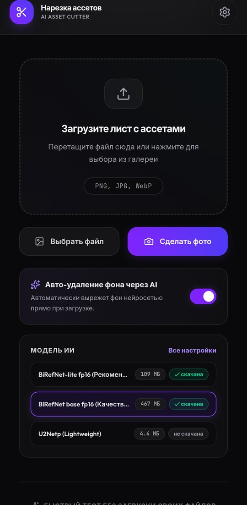
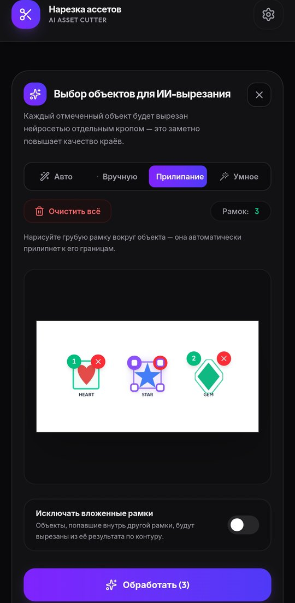
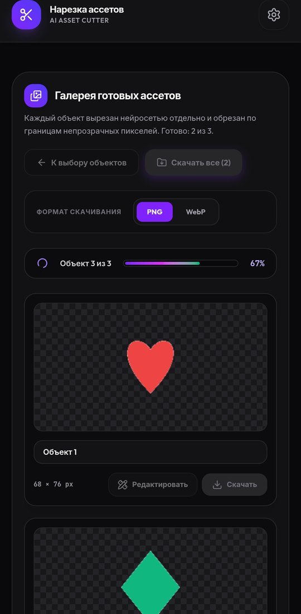

# Asset Slicer — AI Asset Cutter

[🇬🇧 English](README.md) | 🇷🇺 Русский

[](LICENSE) [](https://github.com/dgocker/asset-slicer/releases) [](https://github.com/dgocker/asset-slicer/actions/workflows/build-apk.yml)

**📱 [Скачать APK (последний релиз)](https://github.com/dgocker/asset-slicer/releases/latest/download/asset-slicer.apk)**

Вырезание игровых ассетов из спрайт-листов, наборов иконок и фотографий — целиком на
телефоне, офлайн. Выделите объекты на листе, и локальная нейросеть вырежет каждый из
них отдельной картинкой с прозрачным фоном. Без серверов и без отправки изображений.

Стек: React + TypeScript + Vite и Capacitor (Android). Инференс выполняется нативно
через ONNX Runtime.

## Скриншоты

| Выбор модели | Выбор объектов | Галерея ассетов |
|---|---|---|
|  |  |  |

## Возможности

- **Выбор объектов на листе** — автоматическая детекция, ручные рамки, прилипание к
  краям и умное выделение по контуру внутри рамки.
- **ИИ-вырезание по объектам** — каждое выделение кропится и сегментируется отдельно
  (BiRefNet на ONNX Runtime), полностью на устройстве; изображения никуда не
  отправляются.
- **Каскад фолбэков** — если маленький кроп сбивает модель, приложение повторяет
  прогон с расширенным контекстом, затем по региону, и в конце вырезает по цвету
  фона — пустой результат почти исключён.
- **Галерея со встроенным редактором** — ластик и кисть восстановления,
  кадрирование, поворот, изменение размера с сохранением пропорций, экспорт в
  PNG/WebP с живым предпросмотром веса файла.
- **Докачка моделей** — модели скачиваются при первом использовании с
  возобновлением по HTTP Range и проверкой SHA-256, после чего кэшируются на
  устройстве.
- **Исключение вложенных объектов** — объект, целиком лежащий внутри другого
  (алмаз на короне), автоматически вычитается из родительского ассета.

## Модели

| Пресет | Размер | Лицензия | Примечание |
| --- | --- | --- | --- |
| BiRefNet-lite fp16 (по умолчанию) | 109 МБ | MIT | Быстрая, хорошее общее качество |
| BiRefNet base fp16 («Качество») | 467 МБ | MIT | Swin-Large; берёт мелкие и бледные объекты, нужен телефон с 8+ ГБ ОЗУ |
| U2Netp | 4.4 МБ | Apache-2.0 | Крошечная и быстрая, качество ниже |

Оба пресета BiRefNet — fp16-конверсии MIT-весов с сохранёнными fp32
входами/выходами. Интерфейс: входной тензор `input_image`, 1024×1024,
ImageNet-нормализация; на выходе логиты, к которым применяется sigmoid. Через экран
настроек можно добавить любую свою ONNX-модель по URL.

**Хостинг моделей:** пресеты скачиваются из [GitHub Releases](https://github.com/dgocker/asset-slicer/releases) этого репозитория. При форке приложите модели к своему релизу и обновите URL в `src/App.tsx`. Модели можно получить из
экспортов [onnx-community/BiRefNet-ONNX](https://huggingface.co/onnx-community/BiRefNet-ONNX)
/ [onnx-community/BiRefNet_lite-ONNX](https://huggingface.co/onnx-community/BiRefNet_lite-ONNX)
через `onnxconverter_common.float16.convert_float_to_float16(keep_io_types=True)`.
Сервер должен поддерживать HTTP Range, иначе прерванные загрузки не будут
докачиваться.

## Сборка

Требования: Node.js 20+, JDK 21, Android SDK.

```bash
npm install
npx vite build
npx cap sync android
cd android && ./gradlew assembleDebug
```

APK появится в `android/app/build/outputs/apk/debug/`. Веб-сборка — только интерфейс:
ИИ-обработка реализована в нативном Android-плагине, поэтому в браузере работает
только вырез без ИИ по цвету фона.

## Структура проекта

```
src/
  App.tsx                 # основной поток: выбор → обработка → галерея
  components/
    ObjectSelector.tsx    # выбор объектов на листе
    AssetGallery.tsx      # галерея вырезанных ассетов
    AssetEditor.tsx       # редактор ассета (ластик/восстановление, кадр, экспорт)
  plugins/
    backgroundRemoval.ts  # Capacitor-мост к нативному плагину
android/
  .../BackgroundRemovalPlugin.kt  # инференс на ONNX Runtime (CPU EP), докачка
                                  # моделей, raw-режим маски
```

## Замечание о безопасности

В репозитории лежит `debug.keystore`, чтобы debug-сборки из релизов можно было
обновлять поверх установленных. Это общеизвестный отладочный ключ — для продакшена
сгенерируйте собственный ключ подписи и не коммитьте его.

## Лицензия

MIT — см. [LICENSE](LICENSE). Лицензии сторонних компонентов и моделей перечислены в
[THIRD_PARTY_LICENSES.md](THIRD_PARTY_LICENSES.md).
